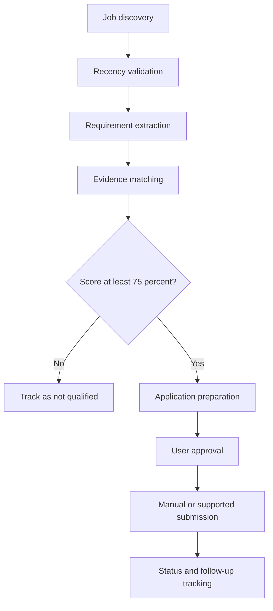

# Application Buddy

Application Buddy is an evidence-first job-search agent for customer-facing AI roles. It discovers roles, validates recency, compares each requirement against verified resume and portfolio evidence, rejects weak matches, prepares application materials, and tracks every action.

## Current release

Version 0.4 adds evidence-locked résumé and application-answer generation to the intake, tracking, scoring, and approval foundation.

- Resume evidence inventory
- Portfolio evidence placeholders for CF-001 and CF-002
- Weighted requirement scoring
- 75 percent qualification gate
- Non-negotiable requirement gate
- Evidence-locked resume tailoring plan
- Conservative software matching with candidate confirmation
- Bachelor’s expected graduation recorded as December 2026
- No planned or in-progress certifications stored or used
- Verified public-contact research rules with separately labeled inferred emails
- Google Sheets and Notion tracking schemas
- Separate future consulting-prospecting mode
- Validated job intake records
- Conservative requirement extraction with mandatory review
- Recency assessment that preserves unverified posting dates
- Enforced contact evidence and inferred-email safeguards
- Human approval queue for consequential actions
- Google Sheets-ready tracker workbook
- Review-only résumé content generation
- ATS-readable DOCX rendering
- Sensitive application-question blocking
- Evidence-bound application-answer drafts
- Auditable résumé change reports
- Clear separation of verified evidence, user-provided evidence, inference, and recommendation
- JSON output suitable for a spreadsheet or later database

Application submission is intentionally outside version 0.1. A later module will require user approval for legal attestations, voluntary disclosures, salary expectations, work authorization, relocation, and other sensitive answers.

## Architecture



## Repository structure

```text
application-buddy/
  docs/
    architecture.md
    project-roadmap.md
    resume-audit.md
    ai-agent-project-ideas.md
  examples/
    sample-job.json
    sample-job-intake.json
  src/application_buddy/
    __init__.py
    approval_queue.py
    contact_records.py
    change_report.py
    application_answers.py
    docx_renderer.py
    job_intake.py
    recency.py
    requirement_extractor.py
    resume_draft.py
    resume_builder.py
    scorer.py
  templates/
    application-buddy-tracker-v0.3.xlsx
  tests/
    test_scorer.py
  data/
    candidate-evidence.json
```

## Run the scorer

```bash
python3 -m src.application_buddy.scorer \
  --job examples/sample-job.json \
  --evidence data/candidate-evidence.json
```

Run tests:

```bash
python3 -m unittest discover -s tests -v
```

Create an evidence-locked resume tailoring plan:

```bash
python3 -m src.application_buddy.resume_builder \
  --job examples/sample-job.json \
  --evidence data/candidate-evidence.json
```

## Accuracy contract

Application Buddy never invents jobs, dates, salaries, contacts, requirements, qualifications, metrics, or submission status. Unknown information stays unknown. A generated email pattern is always labeled `INFERRED`, never `VERIFIED`, and requires source evidence and verification before outreach. Submission only receives a `SUBMITTED` status after confirmation from the application system.

## Release status

- Version 0.1: evidence inventory, scoring, and résumé tailoring foundation
- Version 0.2: education, contact research, tracking, and consulting-mode rules
- Version 0.3: job intake, requirement extraction, recency records, contact validation, approval queue, and Google Sheets-ready tracker
- Version 0.4: review-only résumé generation, DOCX rendering, application-answer controls, and change reports

## Planned releases

- Version 0.5: verified public people research and outreach preparation
- Version 0.6: approval-controlled browser workflow
- Version 1.0: modular job-search workflow with audit logs

Consulting lead generation will live in a separate operating mode, or a separate agent if its scope grows. Job contacts and sales prospects never share scoring, pipelines, messages, or status fields.
