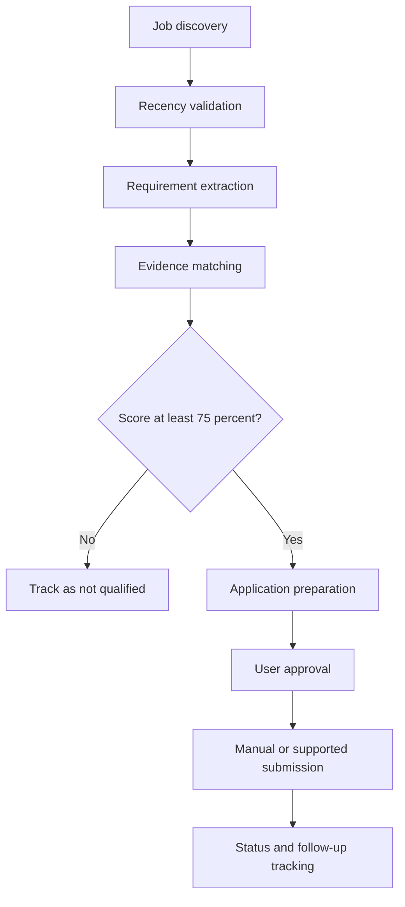

# Application Buddy

Application Buddy is an evidence-first job-search agent for customer-facing AI roles. It discovers roles, validates recency, compares each requirement against verified resume and portfolio evidence, rejects weak matches, prepares application materials, and tracks every action.

## Current release

Version 0.1 establishes the scoring and evidence foundation.

- Resume evidence inventory
- Portfolio evidence placeholders for CF-001 and CF-002
- Weighted requirement scoring
- 75 percent qualification gate
- Non-negotiable requirement gate
- Evidence-locked resume tailoring plan
- Clear separation of verified evidence, user-provided evidence, inference, and recommendation
- JSON output suitable for a spreadsheet or later database

Application submission is intentionally outside version 0.1. A later module will require user approval for legal attestations, voluntary disclosures, salary expectations, work authorization, relocation, and other sensitive answers.

## Architecture



## Repository structure

```text
application-buddy/
  docs/
    architecture.md
    project-roadmap.md
    resume-audit.md
    ai-agent-project-ideas.md
  examples/
    sample-job.json
  src/application_buddy/
    __init__.py
    resume_builder.py
    scorer.py
  tests/
    test_scorer.py
  data/
    candidate-evidence.json
```

## Run the scorer

```bash
python3 -m src.application_buddy.scorer \
  --job examples/sample-job.json \
  --evidence data/candidate-evidence.json
```

Run tests:

```bash
python3 -m unittest discover -s tests -v
```

Create an evidence-locked resume tailoring plan:

```bash
python3 -m src.application_buddy.resume_builder \
  --job examples/sample-job.json \
  --evidence data/candidate-evidence.json
```

## Accuracy contract

Application Buddy never invents jobs, dates, salaries, contacts, requirements, qualifications, metrics, or submission status. Unknown information stays unknown. Submission only receives a `SUBMITTED` status after confirmation from the application system.

## Planned releases

- Version 0.2: job intake, requirement extraction, and recency records
- Version 0.3: spreadsheet tracker and role review queue
- Version 0.4: tailored resume and application-answer preparation
- Version 0.5: verified public people research and outreach preparation
- Version 0.6: approval-controlled browser workflow
- Version 1.0: modular job-search workflow with audit logs
